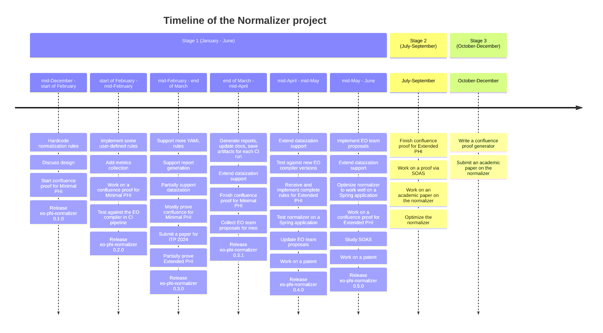

# Normalizer documentation

Additional documentation for the [normalizer](https://github.com/objectionary/normalizer) project.

## Timeline



## Architecture

### Utility tree

See [Utility Tree](https://github.com/objectionary/normalizer/issues/321).

### Structurizr

The diagrams are described in the [Structurizr DSL](https://docs.structurizr.com/dsl).

1. Install VS Code extension - `systemticks.c4-dsl-extension`

1. Pull image:

    ```sh
    docker pull structurizr/lite
    ```

1. Run:

    ```sh
    docker run -it --rm -p 8080:8080 -v ./architecture:/usr/local/structurizr -e STRUCTURIZR_WORKSPACE_PATH=. structurizr/lite
    ```

1. Learn more - [link](https://github.com/structurizr/)

## Stand-up bot

[repo link](https://github.com/deemp/scrum-standup-telegram-bot)

