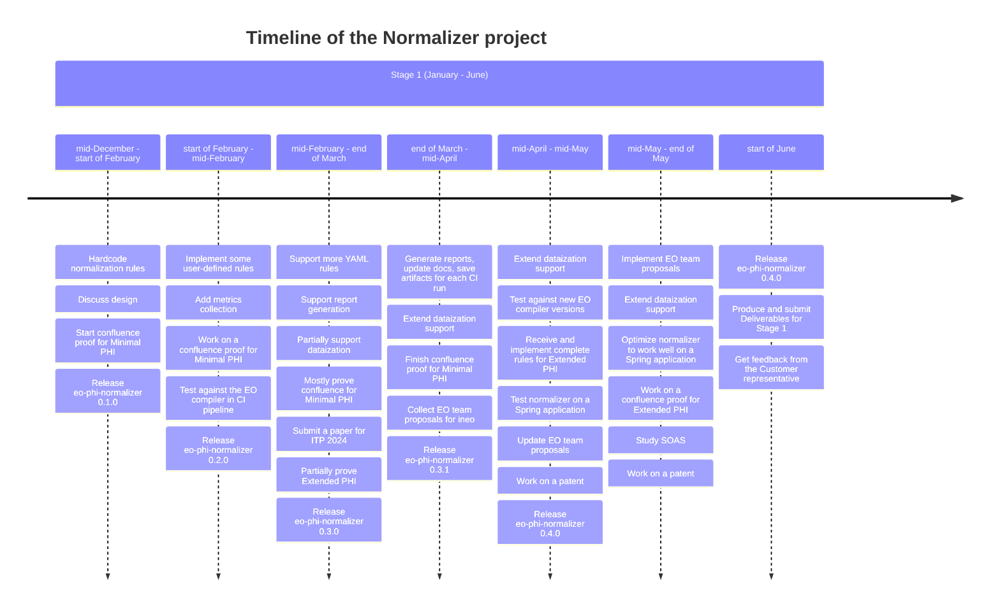
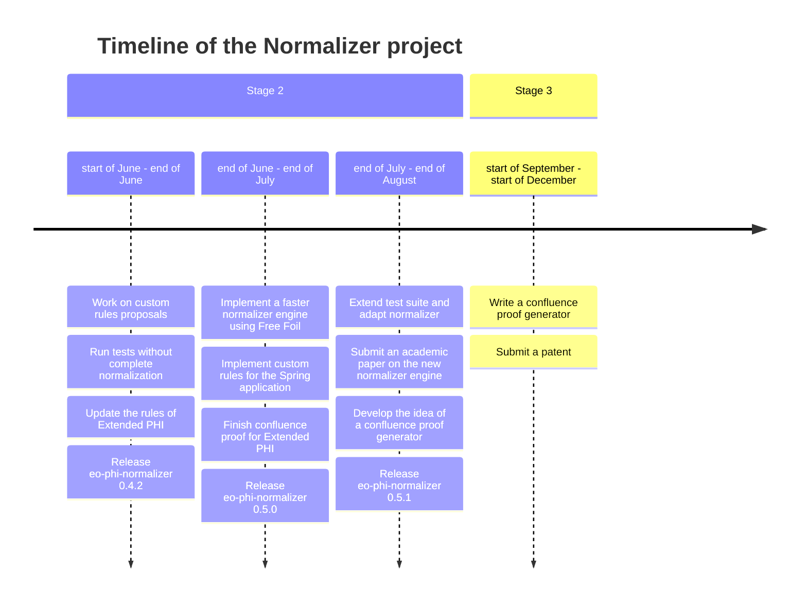

# Normalizer documentation

Additional documentation for the [normalizer](https://github.com/objectionary/normalizer) project.

## Confluence proof

It's assumed that the rewriting system used for normalization is confluent.

This [repository](https://github.com/objectionary/proof) contains a confluence proof in Lean 4.

Here ([link](https://www.overleaf.com/4611428655spqyynvnqgrt#978f7a)) are the questions about PHI and sample programs.

## Timeline





## GitHub Issues

[link](https://github.com/objectionary/normalizer/issues).

Issues are labelled.

Issues are prioritized ([priority 1](https://github.com/objectionary/normalizer/issues?q=is%3Aopen+is%3Aissue+label%3A%22priority+1%22), ..., [priority 5](https://github.com/objectionary/normalizer/issues?q=is%3Aopen+is%3Aissue+label%3A%22priority+5%22+)) because we want to know what issues to work on first.

Issues are categorized by the scope they belong to ([(dataization)](https://github.com/objectionary/normalizer/issues?q=is%3Aissue+is%3Aopen+label%3A%28dataization%29+), [(atoms)](https://github.com/objectionary/normalizer/issues?q=is%3Aissue+is%3Aopen+label%3A%28atoms%29+), etc.) because we want to know what remains to be done in a particular part of the project.

Some issues are related to non-functional requirements ([[peformance]](https://github.com/objectionary/normalizer/issues?q=is%3Aissue+is%3Aopen+label%3A%5Bperformance%5D+), etc.) because it's convenient to track non-functional requirements as issues.

## Architecture

### Notes

See [Notes](general-notes.md)

### Utility tree

See [Utility Tree](https://github.com/objectionary/normalizer/issues/321).

### Structurizr

The diagrams are described in the [Structurizr DSL](https://docs.structurizr.com/dsl) in [this file](./architecture/workspace.dsl).

The rendered version is available at this [link](https://structurizr.com/share/91641/24dd60f5-f95c-4b23-b477-9f4d3ebc6f3c).

1. Install VS Code extension - `systemticks.c4-dsl-extension`

1. Pull image:

    ```sh
    docker pull structurizr/lite
    ```

1. Run:

    ```sh
    docker run -it --rm -p 8080:8080 -v ./architecture:/usr/local/structurizr -e STRUCTURIZR_WORKSPACE_PATH=. structurizr/lite
    ```

1. Learn more - [link](https://github.com/structurizr/)

### Alternatives

#### LikeC4

Not used in this project.

[link](https://likec4.dev/)

Features:

- arbitrarily deep nesting of layers

Currently missing functionality:

- custom colors
- custom shapes
- dynamic views

## Analytics

Command:

```sh
git fetch normalizer master:master
git log normalizer/master --no-merges --date=short --pretty=format:'%h | %an | %ad | %s' > data/commits.csv
```

- [commits](./data/commits.csv)
- [script](analytics_tools/commits.py)

## CI

Sample run ([link](https://github.com/objectionary/normalizer/actions/runs/8976635334)).

For each workflow on PR:

- Check the code via the `hlint` linter.
- Check the code formatting via the `fourmolu` formatter.
- Run `normalizer` unit tests, confluence tests, doctests on `Linux`.
- Run pipeline with EO on `Linux`, `Windows`, `macOS`.
  - Test without normalization.
  - Test with normalization.
- Commit updated `PHI` atoms.
- Update `normalizer` docs and commit changes.
- Save pipeline artifacts so that they can be inspected later.
- Produce a job summary with a report so that one can see metrics for the workflow.

Additionally, on `master`:

- build the site
- build `Haddock` docs and add them to the site
- build report and add it to the site
- publish the site

## Processes

### Proof team reports

- Danila sends a message to the team Telegram chat every Friday at 12:00. The message asks the proof team about their progress and provides a link to an issue for a report.
  - Messages and issues are scheduled for every week till early August. Issues are available in the `objectionary/proof` repository ([link](https://github.com/objectionary/proof/issues?q=is%3Aissue+is%3Aclosed+%5Breport%5D)).
- Nickolay, Anatoliy, Violetta reply.
- Anatoliy writes a report in the linked issue.
- At 18:00, Danila checks the issue and asks Anatoliy to add missing details.


## Documents

- [Quality Plan](https://docs.google.com/document/d/1Rt7J87Mq_zzY-1vyLrTlqFe23zezw4I41yJE73ObgGk/edit?usp=sharing)
- [ASS final presentation](https://docs.google.com/presentation/d/1yDkyhUldUwvb1oSDPrJzZHJGthF7Suc3T3OEuq3qOfY/edit?usp=sharing)
- [Risk management](https://docs.google.com/presentation/d/1T3vpHEK6slE48Gds3317EYC_Dxflhj-JY-KTjNE6hwg/edit?usp=sharing)
